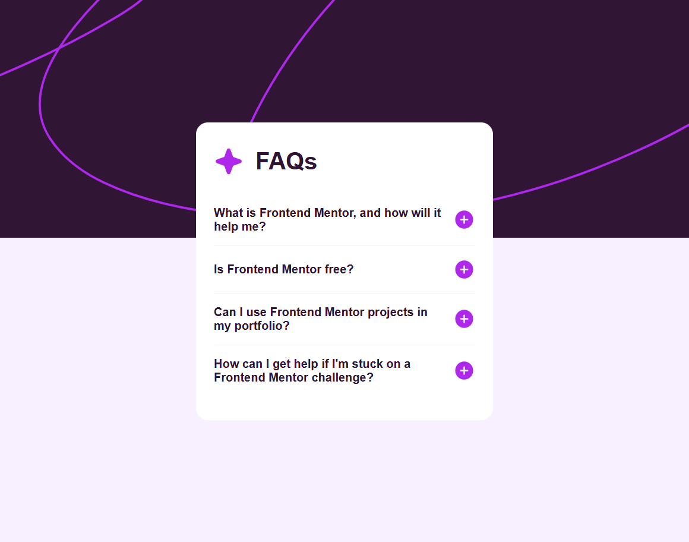
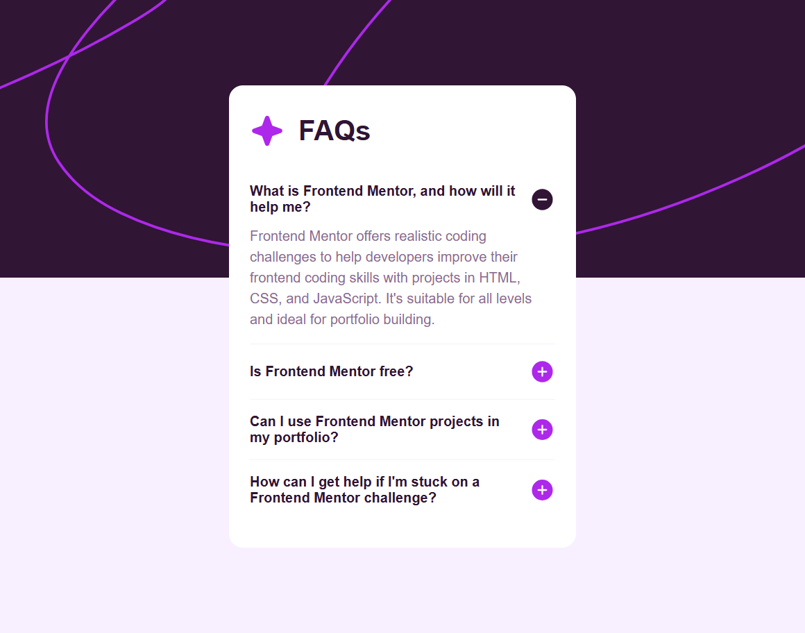

# Frontend Mentor - FAQ Accordion Solution

This is my solution to the Frontend Mentor **FAQ Accordion** challenge. The project focuses on building an accessible accordion component using semantic HTML and CSS while creating a responsive layout that works across different screen sizes.

## Overview

### The Challenge

Users should be able to:

* Expand and collapse FAQ items by clicking on a question.
* View different icons depending on the accordion state (plus/minus).
* Navigate the page using keyboard controls thanks to native HTML elements.
* View an optimized layout on desktop and mobile devices.
* See clear visual hierarchy and readable content.

### Screenshot




### Links

- Solution URL: [Frontend Mentor](https://www.frontendmentor.io/profile/Ismaellerakotoson)
- Live Site URL: [Live Demo](https://ismaellerakotoson.github.io/faq-accordion)

## Built With

* Semantic HTML5
* CSS Custom Properties
* Flexbox
* Mobile-first workflow
* Native `<details>` and `<summary>` elements
* Google Fonts (Work Sans)

## Features

* Accessible accordion built without JavaScript.
* Plus and minus icons that change according to the accordion state.
* Responsive design.
* Clean and maintainable CSS using custom properties.
* Native browser support for keyboard navigation.

## What I Learned

One of the most interesting things I learned from this project was how powerful the native HTML `<details>` and `<summary>` elements are. They allow the creation of an accordion component without writing JavaScript while maintaining accessibility.

Example:

```html
<details>
  <summary>Is Frontend Mentor free?</summary>
  <p>
    Yes, Frontend Mentor offers both free and premium coding challenges.
  </p>
</details>
```

I also practiced using CSS attribute selectors to style elements based on their state:

```css
details[open] summary .icon-plus {
  display: none;
}

details[open] summary .icon-minus {
  display: block;
}
```

## Continued Development

In future projects, I would like to:

* Improve my accessibility knowledge.
* Create more interactive components using only HTML and CSS when possible.
* Continue practicing responsive layouts.
* Explore advanced CSS animations for accordion transitions.

## Useful Resources

* Frontend Mentor – For realistic frontend challenges.
* MDN Web Docs – For understanding the `<details>` and `<summary>` elements.
* CSS Tricks – For responsive design techniques and CSS best practices.

## Author

- Frontend Mentor - [@Ismaellerakotoson](https://www.frontendmentor.io/profile/Ismaellerakotoson)
- GitHub - [@Ismaellerakotoson](https://github.com/ismaellerakotoson)

## Acknowledgments

Thanks to the Frontend Mentor community for feedback and inspiration. This challenge was a great opportunity to practice semantic HTML and responsive CSS techniques.